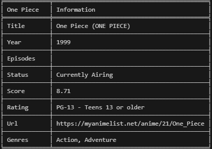

# Anime Info Script

This Python script allows users to search for anime information using the Jikan API. It provides details about anime, including titles, years, episodes, status, scores, and more. Additionally, the script offers features like displaying ASCII art, showing recommendations, and presenting anime synopses.

## Prerequisites

Make sure you have the following installed:

- Python (version 3.x)
- Required Python packages: `jikanpy`, `InquirerPy`, `tabulate`, `ascii_magic`, `Pillow` (install them using `pip install -r requirements.txt`)

## Usage

1. Run the script using the command: `python project.py`
2. Choose between searching for TV shows or movies.
3. Enter the name of the anime you want to search for.
4. Explore various options such as viewing information, ASCII art, synopses, recommendations, and more.

## Features

- **Search:** Retrieve information about anime titles.
- **Information Display:** View detailed information about a specific anime, including its synopsis.
- **ASCII Art:** Experience visual representations of anime coverf through ASCII art.
- **Recommendations:** Get recommendations for TV shows.

## Screenshots

### Anime Information



### ASCII Art


### Recommendations


## Example

```bash
$ python project.py
